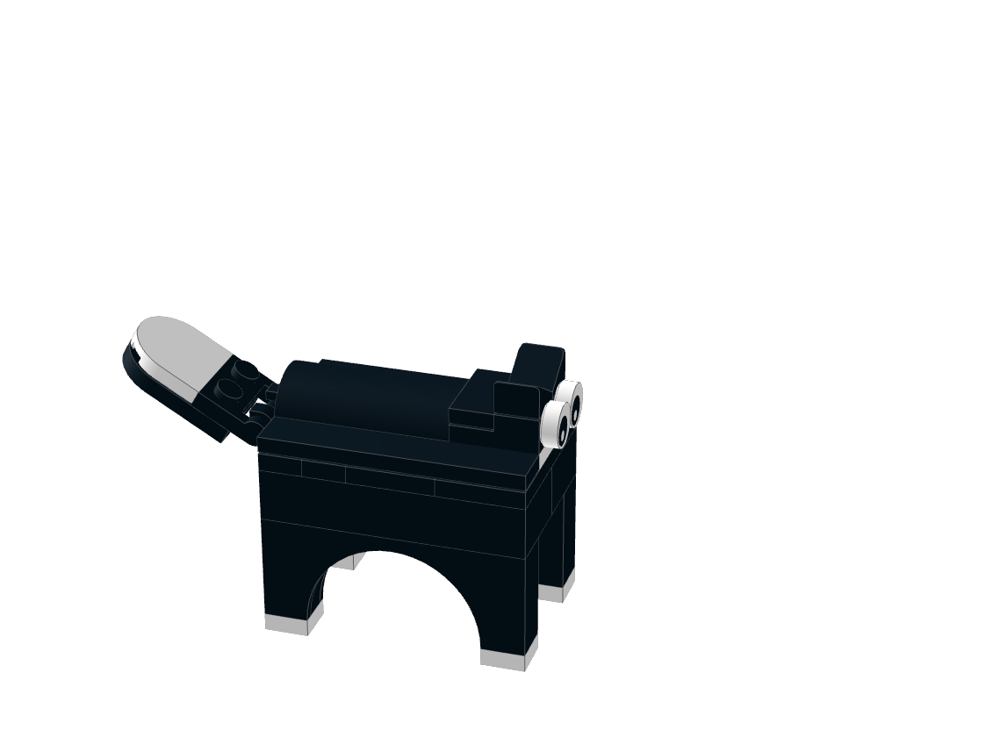
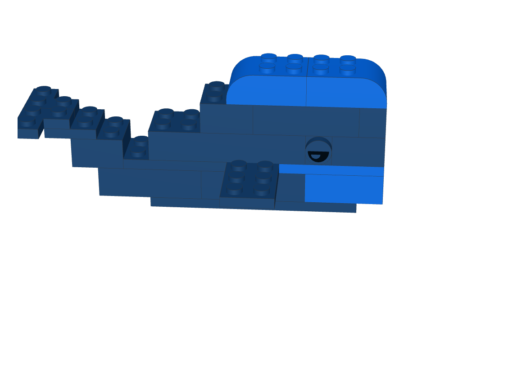

# Brick Ideas 🧱

A growing collection of original LEGO builds designed in [BrickLink Studio](https://www.bricklink.com/v3/studio/download.page) —
currently mostly critters, but not for long. Each one ships as a `.io` file
you can open and remix yourself, plus a ready-to-print PDF if you'd rather
just follow the steps and build.

## Builds

| Preview | Build | Model | Instructions |
|---|---|---|---|
| <a href="swinging-monkey"></a> | Swinging Monkey Tree | [`.io`](swinging-monkey/monkey-tree.io) | [`.pdf`](swinging-monkey/monkey-tree.pdf) |
| <a href="tasmanian-tiger"></a> | Tasmanian Tiger | [`.io`](tasmanian-tiger/tasmanian-tiger.io) | [`.pdf`](tasmanian-tiger/tasmanian-tiger.pdf) |
| <a href="black-cat"></a> | Black Cat | [`.io`](black-cat/black-cat.io) | [`.pdf`](black-cat/black-cat.pdf) |
| <a href="whale"></a> | Whale | [`.io`](whale/whale.io) | [`.pdf`](whale/whale.pdf) |

## Building one yourself

1. Install [BrickLink Studio](https://www.bricklink.com/v3/studio/download.page) (free).
2. Open the model's `.io` file, or print the `.pdf` and build step by step.
3. Want the real bricks? Studio can export a parts list you can price out
   on BrickLink.

## extract_io_image.py

Pulls the embedded preview thumbnail out of a `.io` file (it's just a zip
under the hood) so the table above stays in sync with each model.

```
python extract_io_image.py path/to/model.io [output_dir]
python extract_io_image.py --scan [root_dir]
```

`--scan` walks a directory for `.io` files, extracts a thumbnail only if one
isn't already sitting next to it, and reports any `.io` missing an
instruction PDF. PDFs are not auto-generated — export those manually from
BrickLink Studio.

## License

CC BY-NC 4.0 — see [LICENSE](LICENSE). Non-commercial use, credit required.
