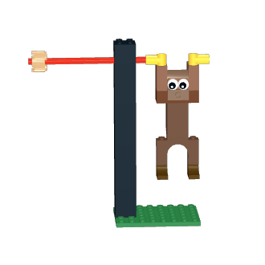

# Brick Ideas

BrickLink Studio (`.io`) builds, tracked with their preview thumbnail and
instruction PDF.

## Builds

| Preview | Build | Model | Instructions |
|---|---|---|---|
| [](swinging-monkey) | Swinging Monkey Tree | [`.io`](swinging-monkey/monkey-tree.io) | [`.pdf`](swinging-monkey/monkey-tree.pdf) |
| [](tasmanian-tiger) | Tasmanian Tiger | [`.io`](tasmanian-tiger/tasmanian-tiger.io) | [`.pdf`](tasmanian-tiger/tasmanian-tiger.pdf) |

## extract_io_image.py

Extracts the embedded preview thumbnail from a `.io` file (it's just a zip).

```
python extract_io_image.py path/to/model.io [output_dir]
python extract_io_image.py --scan [root_dir]
```

`--scan` walks a directory for `.io` files, extracts a thumbnail only if one
isn't already sitting next to it, and reports any `.io` missing an
instruction PDF. PDFs are not auto-generated — export those manually from
BrickLink Studio.
